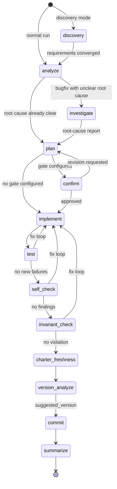

<p align="center"></p>

# tianluo (田螺) — the Software Engineering 3.0 flow engine


**English** | [中文](README.zh.md)

> **A project-level, cross-session flow framework where the program — not the human — supervises the AI agent. You prompt once, walk away, and come back to a finished deliverable.**

*tianluo is named after the Snail Girl (田螺姑娘) of Chinese folklore: a farmer comes home each day to find the housework quietly finished — the spirit did the work while he was away, never asking, never interrupting. That is this tool's contract. You call it by its short name: the command is `luo`.*

tianluo (formerly published as *se3*; the methodology is still called **SE 3.0**) is not a single-session prompting tool, a skill, a subagent, or a dynamic workflow. Those are *in-session* aids that augment one human-in-the-loop turn. tianluo sits one layer above: it is a CLI engine + persistent state machine + a code-first knowledge system (code-index + charter + why-comments) that supervises an AI coding agent across many sessions, on many machines, until the work is actually done.

---

## Why tianluo

Five load-bearing bets, each with the one line of evidence that makes it real rather than aspirational.

**1. What it saves is human attention, not tokens.** A flow is measured by how few times it makes a person read, judge, and decide — not by how cheap the LLM calls were.
*Evidence:* the only point where attention is structurally required is the opening prompt — everything from `plan` through `commit` runs with nobody watching, and even the grouping gate after `plan` is something you opt into.

**2. The program is the supervisor; the human is out of the loop.** The thing that decides what happens next is a deterministic Python state machine, not the model and not a person at a terminal.
*Evidence:* `tianluo/state/engine.json` persists step / attempt / context / fix-loop history, so a flow survives terminal exits, machine restarts, and hand-offs between machines — and resumes at the exact interruption point with `luo run --resume`.

**3. Code is the single source of truth.** Knowledge is exposed through three colocated artifacts — code-index, charter, why-comments — all anchored to the code itself, never a prose mirror of it.
*Evidence:* the `tianluo/specs/**` mirror and its entire governance stack (`luo sync`, `verify_spec`, `update_spec`, `spec_gate`, per-requirement drift baselines) were retired; what replaced them is a deterministically-enumerated structure map plus two anchored checks.

**4. It does not assume the LLM will be conscientious.** Every property the system depends on is enforced by code that runs whether or not the model cooperates:

- **Step routing is a deterministic state machine.** The step pool and the per-task-type default sequences live in `engine/models.py`; `engine/state_machine.py` walks them. The LLM never chooses the next step.
- **code-index completeness is a property of the enumerator.** A filesystem walk + AST symbol enumeration decides *who is on the map*; the LLM only writes the one-line summary for symbols it is handed, so it cannot omit one.
- **`invariant_check` hard-guards `WHY:` / `INVARIANT:` comments.** A diff that deletes or rewrites one without restoring it — or without declaring the new rationale in an updated marked comment — returns `REVISION_NEEDED`.
- **A check-step finding has exactly one destination: the fix loop, now.** There is no discard channel, no severity-based pass-through, no "file it as an issue and fix it later" (the `out_of_scope` escape hatch was removed).
- **`test.critical_tests` blocks skips masquerading as passes.** If a configured critical test is skipped rather than run, the test step fails instead of reporting green.
- **The test baseline is captured deterministically before `implement` writes anything.** It is frozen by the engine, so an inherited red test can never be re-labelled as "caused by this change" — nor the reverse.
- **`investigate`'s net-zero diff is verified by the engine, not promised by the model.** The workspace is snapshotted before and after the step and compared; a mismatch fails the step. The engine never resets or checks out anything itself, because the tree may hold unrelated uncommitted work.
- **The PLAN decomposition decision is write-once.** The doctrine and granularity a flow runs under are resolved at flow creation and persisted; a resumed flow keeps executing the grouping it already entered, whatever the configuration says later, and the engine never re-judges it mid-flow.
- **`version_analyze` errors out when `suggested_version` is missing.** There is no silent patch-bump fallback; the flow stops and asks for a human.

  *In short:* anything that would otherwise hold only because "the LLM should remember to" has been rewritten to hold because the code makes it hold.

**5. It is not tied to one agent.** The `AgentRunner` abstraction already has three shipped adapters, and which one runs is a per-step configuration decision.
*Evidence:* `claude-code`, `claude-interactive`, and `codex` are all live runner types; the `agents` registry mixes vendors and price tiers in one pool; and `llm_caller.steps.<step>` pins a specific chain to a specific step, with automatic rotation *within* that chain.

The long-form version of all five is below: [Design Philosophy](#design-philosophy) for the paradigm, [The knowledge system](#the-knowledge-system-code-index--charter--why-comments) for the code-first bet.

---

## Design Philosophy

### 1. A different paradigm: program-as-supervisor, human out-of-the-loop

Skills, subagents, and dynamic workflows make a *single AI turn* smarter or more parallel. They are valuable, but they assume a human is present, reading output and steering after every step.

tianluo makes a different bet. The unit of work is not a turn; it is a **project task**. Between `luo run "…"` and the final commit there may be dozens of LLM calls across discovery / analyze / (investigate) / plan / confirm / implement / test / self-check / invariant-check / charter-freshness / version-analyze / commit / summarize steps, multiple agent rotations, fix loops, and even multi-machine collaboration via the daemon and central server. The supervisor of all this is the tianluo engine — Python code running a deterministic state machine — not a person watching a terminal.

| Tool class | Scope | Who supervises | Where state lives |
|------------|-------|----------------|-------------------|
| Skills / subagents / dynamic workflows | One session, one turn (or a fan-out within one turn) | Human in the loop, reading output | Conversation context |
| **tianluo** | A project task spanning many sessions / machines | The program (engine + daemon) | Persistent files (`tianluo/state/`, `tianluo/history/`, `tianluo/issues/`) |

### 2. The real pain: attention is all you need

LLMs are not the bottleneck. *Human attention* is. The cost of any agentic system is measured in how often it forces a person to read, judge, and decide. tianluo's north star is **save human attention**.

The ideal tianluo session looks like this:

1. **Prompt** — you type `luo run "…"` (or open a discovery session with `--discover`).
2. **Discover** — the engine asks a few targeted clarifying questions until requirements converge.
3. **Confirm the plan — opt-in, off by default** — with no `confirmation.steps.plan` entry the flow runs `plan → implement` with no gate at all. Add `confirmation.steps.plan: {reviewer: human}` and you get a manual grouping gate: you approve how `plan` carved the work into task groups, or send it back for revision.
4. **Fire-and-forget** — you walk away. The engine implements, tests, self-checks, checks the diff against recorded invariants, flags any charter drift, decides the version, and commits.
5. **Pick up the deliverable** — you come back to a clean commit on a branch, with the version, history, and code-index already aligned.

Steps 1–2, plus the optional gate in step 3 if you turn it on, are the only places where human attention is genuinely required. Everything else is the program's job.

### 3. The four moats that make this paradigm work

A program-as-supervisor paradigm only holds up if the framework provides four things that in-session tools cannot:

- **Cross-session state machine** — `tianluo/state/engine.json` persists the exact step, attempt, context, and fix-loop history of every flow. `luo daemon` keeps a resident process supervising local `luo run` flows; `tianluo-server` aggregates many daemons into one web view; `luo run --worktree` runs the identical flow on an isolated git worktree and merges it back on success. The flow survives terminal exits, machine restarts, and hand-offs between machines. *Why this paradigm needs it:* without durable state, "walking away" loses the work.
- **A code-first knowledge system (code-index + charter + why-comments)** — the source of truth is the code itself. A `tianluo/code-index.md` structure map (auto-maintained, self-freshening) gives the agent an orientation map of *what modules and symbols exist and where*; a small hand-maintained `tianluo/charter.md` carries only the high-altitude facts every step needs in full (project identity, top-level architecture, project-wide invariants); colocated why-comments carry intent the code cannot express. *Why this paradigm needs it:* a long-running unattended agent needs to orient itself in the codebase cheaply on every step without a curated mirror of the code rotting beside it. See [The knowledge system](#the-knowledge-system-code-index--charter--why-comments) below for why this beats the spec-mirror it replaces.
- **Failure recovery built in** — `luo salvage` rescues a crashed session by committing dangling changes, filing follow-up issues, and archiving the state. The test-baseline cache distinguishes a new regression from a pre-existing red test. Issue discovery promotes any unresolved concern into a tracked `tianluo/issues/` record. *Why this paradigm needs it:* when no human is watching, the framework must catch its own failures rather than leak them.
- **Portable substrate** — the engine is pure Python over the file system, and the LLM call layer is a thin `AgentRunner` adapter. This is no longer a single-vendor bet in principle only: three adapters ship today and have run across vendors —
  - **`claude-code`** — a one-shot `claude -p` subprocess (`src/tianluo/claude_runner.py`). The default.
  - **`claude-interactive`** — a pexpect-driven interactive PTY session (`src/tianluo/claude_interactive_runner.py`). Opt-in only: it needs a real terminal, so it is never auto-selected.
  - **`codex`** — the OpenAI Codex CLI (`src/tianluo/codex_runner.py`).

  The abstraction (`AgentRunner` / `RunResult` / `InfraErrorType`) stays provider-neutral, and the boundary is deliberate: **rotation and fallback across commands belong to `LLMCaller`; a single runner never rotates on its own.** Each adapter only knows how to make *one call to one CLI*, translating intent through `build_call_args`, so a new vendor plugs in without touching any caller above it. *Why this paradigm needs it:* a paradigm bet should not be a single-vendor bet.

### luo vs Claude Code Dynamic Workflows (complementary, not competing)

Dynamic Workflows solve *in-session* parallelism: deterministic fan-out, judge panels, pipelines, all inside one orchestrating conversation. They make a single turn comprehensive and confident.

tianluo solves *cross-session* project governance: persistent state, a code-first knowledge system, failure recovery, and a portable substrate that outlives any single conversation.

The two compose. A future tianluo step can delegate its in-step parallel work to a Dynamic Workflow without changing tianluo's outer state machine. We deliberately do not pin to specific DW API names here, because DW is still in research preview and its surface will evolve.

---

## The knowledge system: code-index + charter + why-comments

Earlier tianluo versions kept a parallel corpus of `tianluo/specs/**/spec.md` files — a curated prose mirror of the code — plus an entire governance machine to keep it from drifting: `luo sync` rounds, per-requirement drift baselines, `verify_spec` / `update_spec` / `spec_gate` flow steps, and the whole `sync_*` analyzer/loop/state/discovery stack. tianluo replaced that mirror with three colocated artifacts whose source of truth is the code itself.

### The three pieces

- **code-index** — a *structure map* of the project. Its structure comes deterministically from the code (a filesystem walk + Python AST symbol enumeration: directory/package → file/module → class → function/method); a one-line LLM summary, synthesized bottom-up (a directory's summary from its files', a file's from its symbols'), is attached to each level. It lands as **one self-sufficient file**, `tianluo/code-index.md` — the **authoritative product, committed to git**. It *is* the map, and it is what `luo code-index` renders and what gets injected into every flow step. Because it is plain text in a diff, a wrong summary can be spotted by a human reviewer and corrected, and the correction lands durably. Each node line also carries an embedded content fingerprint (a terse, render-invisible HTML comment), so the committed md *alone* decides what changed: on rebuild only fingerprint-changed nodes are re-summarized by the LLM, unchanged nodes reuse their existing summary (so human corrections survive), and the md is flushed periodically during a build so a crash resumes from where it stopped. There is no separate cache file — structure, summaries, and fingerprints all live in the one committed, human-diffable file.

  The structure comes from the **code**, not from any cache; display reads only the `.md`. The optimization goal is **structural coverage, not summary depth** — the map answers *which modules/symbols exist and where*, and deliberately does not descend into implementation detail (that is the source code's job; copying it into the index would just reproduce a worse-than-code mirror).

- **charter** — `tianluo/charter.md`, the slimmed, renamed successor of the old base spec. It is injected, in full, into every step, and doubles as the conventions channel for sandboxed sub-processes (which cannot read `CLAUDE.md`). An *altitude gate* admits only what is **un-sayable in code and needed in full by the whole project**: project identity, top-level architecture, and project-wide cross-cutting invariants. The per-module locator index that used to bloat the base spec is gone — that job belongs to code-index. A byte threshold is a monitoring light, not a hard wall: because charter content is decoupled from project size (it grows with architectural complexity, not LOC), full-loading it stays cheap even on large projects; if it ever grows hard to load in full, that is a red flag that low-altitude content leaked in — not a reason to build an index over the charter.

- **why-comments** — colocated comments that carry *only* the why/intent that code cannot express, updated only when the why changes. They are not a source for code-index, so there is no per-change synchronization tax; the implement step's prompt simply asks the agent to update the colocated why-comment when a change's intent changes. This is honestly a prompt-level soft convention (same strength as the other conventions), pressing the comment-discipline surface to its minimum rather than eliminating it. The subset marked `WHY:` / `INVARIANT:` is the exception: those are hard-guarded by the `invariant_check` step.

### What actually got better (an honest accounting)

This refactor does **not** make code descriptions more semantically correct: an LLM-generated summary can be wrong in exactly the same way a hand-written spec was. The real gains are elsewhere:

- **Source of truth returns to the code.** Navigation and intent live next to the code, not in a separate corpus that has to be kept honest.
- **Staleness is eliminated.** code-index regenerates incrementally with zero discipline required: a deterministic enumerator re-walks the tree every build, so a newly added symbol is enumerated, a deleted one is pruned, and only fingerprint-changed symbols are re-summarized. Completeness is a *property of the enumerator*, not of LLM diligence — the LLM only summarizes the symbols it is handed and never decides who is included, so it cannot omit a symbol, and a mis-summarized line still appears on the map.
- **The governance maintenance surface collapses.** The entire `sync_*` stack, `verify_spec`, `update_spec`, `spec_gate`, the per-requirement drift baselines, and the old `spec_check` all retire. What remains is two cheap, anchored checks: `invariant_check` (does the diff violate any *already-recorded* binding invariant — anchored to {task description, charter, the touched code's why-comments}?) and `charter_freshness` (an advisory that flags only when the diff plausibly touches one of charter's content classes, and otherwise passes for free).
- **Granularity and admission become explicit knobs.** code-index granularity bottoms out at each file's smallest *natural* semantic unit (code → function/method; structured non-code → its natural unit; opaque files → one file-level line), with line/byte chunking only as a last-resort degrade mode gated behind three simultaneous conditions. Charter content is gated by an admission standard you can read and enforce. Both are dials you turn, not emergent behavior you fight.
- **Charter volume is decoupled from project scale.** It grows with architecture, not lines of code.
- **The failure floor is higher than the old system's.** Even if every soft discipline lapses, the one automatically-maintained artifact — code-index — stays self-fresh. The system's worst case is therefore strictly better than the old system's worst case of *a rotting spec corpus + grep*.

### A concrete before/after — and why spec-index could never win this

Take the old `spec_index.py` (~1130 lines — itself retired by this very refactor) as a worked example. Suppose you need to answer a *navigation* question about it: where is it, what does it do, what are its key symbols?

Without a code-index, you have to read the whole ~1130-line file into context to answer even that. With a code-index, you first read the few map lines about that file — for instance, *"builds an item-level spec index, incremental invalidation via mtime + size + sha256; key symbols `load_or_build` / `_make_summary` / `_extract_locator` / `_h4_dividers`."* Navigation questions never touch the source. And a *precise* question — say, the exact boundary condition of one heuristic — needs only a pinpoint read of those ~30 lines, not the whole file.

**The comparison with spec-index is the sharpest point.** A spec / spec-index has an upside that is *fundamentally capped by living one layer above the code*: even assuming a spec were perfectly accurate and perfectly complete, it still sits at spec altitude and cannot surface the actual code-level detail — so after it locates the file for you, you still have to go back and read the code, and to be thorough you have to read all of it. The spec's likely inaccuracy and incompleteness is merely insult on top of that injury; it is **not** the reason it loses to code-index. code-index is not subject to this cap at the root, because its source of truth *is* the code and it walks you straight to those ~30 lines.

This is exactly the **coverage > depth** bet cashing out: the map's job is to tell you which ~30 lines to flip to — not to replace those ~30 lines. And that context saving is not a one-time win: it compounds on **every step of every flow**, which is precisely the cost code-index exists to cut.

> Historical decisions and retained-but-removed intent (e.g. a feature pulled out while its intent is kept on record) do not enter the charter; they continue through the issue channel (`luo issue`). Cross-file architectural decisions with no single owner enter the charter, hand-maintained, accepting that they cannot be auto-synced.

---

## Installation

```bash
# Core CLI (Python 3.9+)
pip install tianluo

# With the central server / web console
pip install 'tianluo[server]'

# With the headless-browser acceptance test (needs `playwright install chromium` afterwards)
pip install 'tianluo[browser]'
```

The installed console scripts:

| Script | Purpose |
|--------|---------|
| `luo` | **The** command. Short for tianluo — you write `tianluo` down, you call `luo` to work. |
| `tianluo` | Full-name entry, identical to `luo` (docs, demos, discoverability) |
| `se3` | Transitional alias from the rename; prints a migration notice, removed in 13.0.0 |
| `tianluo-server` | Central web server (only with the `server` extra) |
| `se3-server` | Transitional alias for `tianluo-server`, removed in 13.0.0 |

The core CLI never imports the web stack, so installing without `[server]` keeps the dependency surface minimal.

> Prefer a two-letter command? `alias tl=luo` — we deliberately don't ship `tl`
> (the Teal compiler owns it, and two competing short commands would split the
> docs and community vocabulary).

### Migrating an existing project

Two migrators are registered. Which ones you need depends only on how old the
project is — pick your row:

| Your project was last set up on | Run, in this order | What it does |
|---|---|---|
| Before **11.0.0** (the `tianluo/specs/` spec-mirror era) | `luo migrate run spec-to-new-system`, then `luo migrate run rename-to-tianluo` | First retire the spec mirror, then rename the layout. |
| **11.x** (already on code-index + charter, still named `se3`) | `luo migrate run rename-to-tianluo` | `git mv se3/ → tianluo/`, config renames, `.gitignore` rewrite. |
| **12.0.0 or later** | nothing | Already on the current layout. |

```bash
luo migrate list          # every registered migrator, with its id and description
luo migrate run <id>      # run one, as a single reviewable, `git revert`-able commit
```

Order matters for the oldest projects: `spec-to-new-system` converts the legacy
`tianluo/specs/` corpus to the code-index + charter + why-comments system, and
`rename-to-tianluo` then moves the runtime root and configs onto the new names.

Nothing breaks in the meantime. Through all of 12.x the compatibility layer is
still honoured: the `se3` / `se3-server` commands, a legacy `se3/` runtime
directory, and `se3.yaml` / `se3.local.yaml` configs all keep working. **All
legacy fallbacks are removed in 13.0.0** — migrate before then.

---

## Quick Start

```bash
# 1. Initialize a project (creates tianluo.yaml, tianluo/charter.md, .gitignore, git repo)
cd your-project
luo init

# 2. Optional: explore vague requirements through multi-turn discovery first
luo run --discover "I want a CLI tool that does X"

# 3. Run a task end-to-end (see the state machine below)
luo run "Add JWT authentication"

# 4. Resume an interrupted flow exactly where it stopped
luo run --resume

# 5. Navigate the codebase via the structure map
luo code-index                              # adaptive root map: a budgeted, zoomable directory tree
luo code-index index src/tianluo/engine     # drill one literal level (a directory's immediate children)
luo code-index show src/tianluo/cli.py      # one file's full function/method detail
```

### The flow state machine

This is the full-sequence shape (`feature`, `bugfix`, and `--discover` runs).
Every node name is the literal step identifier you will see in logs, in
`tianluo/state/engine.json`, and in `luo history show`:



Three things in that picture are easy to miss:

- **`investigate` is conditional, not a fixed stage.** It is inserted before
  `plan` only when `analyze` classifies the task as a `bugfix` *and* reports
  `root_cause_clear = false`. (The `survey` task type is the other way in — it
  carries `investigate` in its default sequence unconditionally.) The step runs
  under a **net-zero-diff** contract that the engine verifies by comparing a
  workspace snapshot taken before it against one taken after.
- **`confirm` after `plan` is opt-in.** It is inserted only when
  `confirmation.steps.plan` appears in your config — declare it (with
  `reviewer: human` for a manual grouping gate) and a rejection sends the flow
  back to `plan`, not forward.
- **The fix loop is shared.** `test`, `self_check`, and `invariant_check` all
  route failures/findings back into `implement`. A check-step finding has no
  other destination — it cannot be waived, deferred, or downgraded.

### Task types

`luo run --type/-t` accepts exactly five values — `feature`, `bugfix`, `small`,
`review`, `survey`. An unrecognized value is **rejected with an error**, not
silently coerced. Omitting `--type` leaves the run on the `pending` sentinel,
which means *let `analyze` classify it*.

`discovery` is **not** a `--type` value: it is a run mode you enter with
`luo run --discover` / `-d`, and it prepends a `discovery` step to the full
sequence.

| `--type` | Default step sequence | Notes |
|---|---|---|
| `feature` | analyze → plan → implement → test → self_check → invariant_check → charter_freshness → version_analyze → commit → summarize | The full chain; also the fallback for an unknown persisted type. |
| `bugfix` | same as `feature`, plus a conditional `investigate` before `plan` | The only type that can gain `investigate` conditionally. |
| `small` | analyze → implement → test → charter_freshness → version_analyze → commit → summarize | No `plan`, no `self_check`, no `invariant_check`. |
| `review` | analyze → invariant_check → summarize | Read-and-judge only: no implement, no test, no commit. |
| `survey` | analyze → investigate → summarize | Deliverable is a conclusion, not a diff — so no implement/test/commit, and no `version_analyze`. |
| *(`--discover`)* | discovery → *the `feature` chain* | Entered via `--discover`, not `--type`. |

The sequences above are the literal defaults declared in `models.py`, which
contain no `confirm` entry. A `confirm` step is inserted **only** after the
steps listed under `confirmation.steps` — `plan` included: it is an ordinary
opt-in gate like any other, so with no `confirmation.steps.plan` entry a
plan-bearing type runs `plan → implement` with no gate between them.

`analyze` may still adjust the selected sequence; the table is the starting
point, not a frozen contract.

#### PLAN decomposition: how the PLAN → IMPLEMENT phase runs

There is one path, not two. `feature`, `bugfix` and discovery flows always run
ANALYZE → PLAN → IMPLEMENT; no configuration removes PLAN from a sequence. What
varies is what PLAN emits, and — wherever the granularity left the group count
to PLAN — **the execution shape is read off the group count**:

- **one group** → IMPLEMENT runs the whole task as a single autonomous
  implement call;
- **two or more groups** → the dependency DAG applies: independent groups run
  in parallel in isolated worktrees and are merged back, dependent ones run in
  order.

`plan_granularity: single` is the one pin that is a guarantee, not a hint to
PLAN: however many groups PLAN emits, the whole task is delivered by one
autonomous call.

`workflow.plan_decomposition` picks the doctrine PLAN follows:

- **`capability`** (default) — coarse groups whose only sizing criterion is
  *can a single autonomous implement call safely carry this?* One capability
  one call can finish is one group; one it cannot becomes two or more; two
  distinct capabilities one call could still finish together stay one group;
  and on the edge, one capability per group — the more a group aggregates, the
  lower the threshold at which PLAN splits it. Groups may never be cut along
  artifact types or code layers (no separate test, docs or config group):
  testing is part of what each group itself delivers. PLAN emits no per-task
  listing — a group carries only `group_id` / `name` / `description` /
  `group_order` / `depends_on`, and the runner's own planning system
  decomposes it against the real code at execution time.
- **`granular`** — the retained legacy doctrine: fine-grained per-task listing,
  LOC-driven merge and DAG thresholds, requirement→task review at the gate.

`workflow.plan_granularity` applies under `capability` only: `auto` (default)
lets PLAN size the group count itself, `single` pins exactly one group whatever
the task's size, and `conservative` lowers the splitting threshold and errs
toward more groups.

Priority: explicit CLI (`--plan-decomposition` / `--plan-granularity`) or web
request → project config → `capability` + `auto`. The decision is made once at
flow creation and persisted with its reason — a resumed flow keeps the doctrine
it already entered and its groups are never re-judged mid-flow.

The whole-task single-call shape works with every writable agent runner; a
runner's native goal loop (e.g. Claude Code's `/goal` in print mode) is an
optional per-call enhancement, not an entry requirement and never
flow-authoritative state. A partial result or non-empty `incomplete_tasks`
never advances to TEST — the flow re-enters IMPLEMENT through the normal
retry/resume machinery and a later caller continues in the existing workspace.

An optional gate on the grouping is available by declaring `plan` under
`confirmation.steps`; `reviewer: human` makes it a manual grouping gate. Under
`capability` that review asks whether the group count matches the volume of
work, whether any group was cut along a forbidden artifact type, and whether
the `depends_on` declarations hold.

SELF_CHECK is judged against the **effective task description** (original task or
discovery refinement, user interjections, adjudicated description) plus the
charter and `WHY:`/`INVARIANT:` constraints — PLAN, task groups and the
implementation summary are scheduling hints only. Reviews run scoped rounds
built from a recoverable baseline: the first round is `full` over everything the
flow changed, post-fix rounds are `incremental` over the fix's exact diff, and a
clean incremental round is always followed by a `full` closure round before the
flow advances; any change to the effective requirements forces `full` again.
TEST always runs the project's complete configured tests — review scope never
shrinks them — and every validated finding always enters the fix loop.

### Three operating modes

- **`luo run --worktree`** — Run the **identical** flow inside its own git
  worktree: same steps, same state persistence, same `--resume`, same `--type`.
  On success the heavyweight `luo merge` orchestrator merges the branch back
  into the originating branch automatically. Several `--worktree` runs can
  execute concurrently — the flow body holds no lock — and they contend only at
  their final merge, where the main-worktree mutex
  (`tianluo/state/merge.lock`, blocking queue-and-wait) serializes them against
  each other and against any synchronous run. Leaked worktrees from terminal
  runs are reclaimed by `luo worktree gc`.
- **`luo daemon start`** — Launch a resident background process that
  supervises every local `luo run`, aggregates state under
  `tianluo/state|logs|calls|issues`, and (optionally) dials out to a central
  server over a single outbound connection. Lets you check on a flow from
  anywhere.
- **`tianluo-server`** — A FastAPI + WebSocket central server (with a bundled
  static web console at `/`) that merges many daemons into one multi-machine
  view. Useful for fleets, remote launch, and watching long-running flows
  from a browser. Defaults to `127.0.0.1:8080`.

### The web console


The console is not a log viewer bolted onto the CLI — it is the second full
control surface, and for the out-of-the-loop workflow it is usually the one you
live in. What it gives you:

- **Fleet overview across machines.** Every daemon that has bound itself to
  your account shows up in one list, with its projects and its live flows.
  One browser tab covers a laptop, a workstation, and a build box at once.
- **Launch new tasks from the browser.** *+ New Task* picks a target machine, a
  registered project root (or a manually entered absolute path — the daemon
  runs `luo init` there first if it is not a tianluo project yet), a task type
  (or `auto`), and the task text. You never need a shell on the target machine.
- **Answer discovery from the web.** A `--discover` run's multi-turn
  requirement clarification is fully answerable in the browser; the checkbox
  *"Start from discovery step"* is available both on the new-task form and when
  launching a flow from an issue.
- **Human-intervention gates.** A flow that needs you shows up as **PAUSED** /
  **needs response**; you reply inline, approve or reject a plan confirmation
  (`approve` / `reject`, or any other text as a revision request), interject an
  instruction into a still-running flow, then **Resume** — or **End** the
  session and archive it.
- **History.** Finished sessions are browsable step-by-step, with per-step
  records and the total tokens and cost the session consumed.
- **Issues panel.** Browse open and closed issues across machines and projects,
  filter by source / project / type, create issues, close them with a reason,
  and launch a flow directly from one.
- **File uploads, inlined into the prompt.** Drag, paste, or pick files; they
  are relayed to the owning daemon and stored under the project's
  `tianluo/uploads/` as `<content-hash>_<filename>` (20 MB limit per file).
  The path is inlined into the prompt text the agent receives, and image
  attachments additionally render as inline thumbnails under the message —
  the thumbnail is an addition to the prompt text, never a substitution for it,
  and one click opens the full-resolution image.
- **Mobile layout.** The console is responsive down to phone width, so the
  approve/reject gate is answerable from wherever you actually are.


*The fleet overview: several machines, their projects, and every live flow in one view. Screenshot taken on an earlier release, before the rename — the UI still carries the SE3 branding.*


*Answering a confirmation gate from a phone. Screenshot taken on an earlier release, before the rename — the UI still carries the SE3 branding.*

#### Web console authentication

The central server is a multi-tenant control plane — the web console and REST
API require a login, and every machine / flow is scoped to the owner that owns
it. The first-run flow is:

1. **Mint a break-glass admin token** — run `tianluo-server bootstrap-token` once;
   it prints a one-time admin token to the console.
2. **Log in** — open the web console and exchange the token for the break-glass
   admin session (`POST /api/auth/breakglass`).
3. **Create local users** — as admin, invite/create accounts (`POST /api/users`).
   v1 has no public self-service registration.
4. **Issue a daemon key** — each owner self-mints a daemon key in the UI
   (`POST /api/daemon-keys`), then binds a worker with
   `luo daemon start --daemon-key <key>`. The owner only ever sees their own
   machines and flows.

See [docs/daemon-and-server.md](docs/daemon-and-server.md#authentication--multi-tenant-access)
for the full end-to-end auth walkthrough and configuration keys.

---

## Command Reference

Every command below is registered in `src/tianluo/cli.py` or one of its
sub-typers.

### Top-level commands

| Command | Purpose |
|---------|---------|
| `luo run [TASK]` | Unified entry point. Drives the flow-engine state machine (see [the diagram above](#the-flow-state-machine)). Flags: `--resume` / `-r`, `--type` / `-t`, `--change` / `-c`, `--flow-id`, `--discover` / `-d`, `--from-issue`, `--output-format`, `--preset`, `--worktree`. |
| `luo init` | Initialize a new project: writes `tianluo.yaml`, `tianluo/charter.md`, `.gitignore`, and runs `git init` if needed. Flags: `--project-root` / `-p`, `--name` / `-n`, `--force` / `-f`. |
| `luo guardrails <spec-file>` | Run tianluo guardrails on a file (deleted-line / weakened-language detection); `--sizes` runs project-wide size checks. Used by `luo merge`. Flag: `--original` / `-o <baseline-file>`. |
| `luo merge <branch> [<branch> ...]` | Sequentially merge branches into HEAD with LLM-driven conflict resolution, then reconcile the final version from the merged-in intents. Flags: `--strategy` / `-s` `fast\|safe\|strict`, `--delete-merged` / `-d`, `--no-delete-merged`. Runtime data under `tianluo/` is synchronized per the tiered policy. |
| `luo merge-respond <call-file>` | Apply a human decision file produced by `luo merge` when conflicts or guardrail violations escalated to a human call. |
| `luo merge-unlock` | Inspect and release the project's merge lock (`tianluo/state/merge.lock`). Always reports the holder PID, its liveness, and the lock path. A stale lock is cleaned up automatically; a lock held by a live *local* process is refused unless `--force` / `-f` is given. A lock owned by **another machine** is never auto-broken — releasing it is always an explicit operator decision. |
| `luo salvage` | Best-effort recovery of an abnormally terminated session: tolerant state load, commit dangling diff, file follow-up issues, archive the session. Flag: `--project-root` / `-p <path>`. |
| `luo end-session [FLOW_ID]` | End and archive a session: terminate the live `luo run` process (clearing its pid file) and archive the state. A `--worktree` session is archived like a completed run — worktree archived, terminal state promoted, history synced, isolation branch and worktree removed — but its unfinished work is **not** merged. Flags: `--project-root` / `-p`, `--pid`, `--no-archive-worktree`. |

#### `luo run` flags worth knowing

- **`--preset <name>`** — Run a task from the **preset prompt library** instead
  of typing the prompt. Presets come from two layers merged into one registry:
  the built-in layer shipped inside the package, and a project layer of
  markdown files under `tianluo/prompts/` (committed with the project), whose
  metadata — `type` and `prompt_file` — is declared in the `presets:` block of
  `tianluo.yaml`. **The project layer overrides the built-in layer on a name
  collision.** `luo run --preset list` prints every available preset with its
  type and layer. A preset carries its own task type, so it is mutually
  exclusive with an explicit `--type`.
- **`--from-issue <id>`** — Start a flow whose input is an existing issue from
  `tianluo/issues/`, and write the outcome back to that issue when the flow
  finishes (a completed flow resolves it). This is the intended follow-up path
  after `luo salvage` files issues for unfinished work.
- **`--plan-decomposition capability|granular`** — The explicit decomposition
  doctrine for a new flow (see the PLAN decomposition section above). Omitted,
  it falls back to the project config and then to `capability`.
- **`--plan-granularity auto|single|conservative`** — The explicit group-count
  pressure for a new flow; effective under `capability` only. Omitted, it falls
  back to the project config and then to `auto`.
  Both options are ignored on a resume: the flow keeps the doctrine it was
  created with.
- **`--implementation-strategy auto|direct|planned`** — **Deprecated, removed
  in the next major version.** Kept for one version and mapped onto the two
  options above (`direct` → `--plan-granularity single`, `planned` →
  `--plan-decomposition granular`, `auto` → the new defaults), with a
  deprecation warning. An explicitly-typed new option wins over the mapping.

### `luo code-index` — the structure map

| Subcommand | Purpose |
|------------|---------|
| `luo code-index` | Render the **adaptive root map** from `tianluo/code-index.md`: a byte-budgeted, zoomable directory tree (top level always shown; code directories expanded a few levels deep within the budget). This is the same map injected into every flow step. Reads the committed map (reports "not built" until you run `rebuild`); flow steps keep it fresh lazily/incrementally. |
| `luo code-index index [PATH]` | Render exactly **one literal level** at `PATH`: a directory's immediate children (subdirs + files), or a file's functions/methods. No argument → the literal root level. Unlike the bare command, it never auto-expands. |
| `luo code-index show <path>` | Print one file's full function/method detail (and any degraded chunks) from the structure map. |
| `luo code-index search <pattern>` | Grep the map's item lines — a drop-in for `grep tianluo/code-index.md`, except a matched **symbol** line carries its owning file's full path (`relpath::local_id`) and no fingerprint comments leak into the output. Grep-aligned syntax: regex by default, `-i` / `--ignore-case`, `-F` / `--fixed-strings`, `-m N` / `--max-count`, `-n` / `--line-number`. Exit code follows grep (0 = matched, 1 = none, 2 = bad regex). |
| `luo code-index rebuild [--force]` | Rebuild the code-index, flushing the md periodically as a checkpoint. Incremental by default (only fingerprint-changed nodes are re-summarized); `--force` re-summarizes everything. |
| `luo code-index inspect` | Show code-index stats (file / symbol / degraded-chunk counts) from the on-disk map. |

### `luo history` — flow history

| Subcommand | Purpose |
|------------|---------|
| `luo history` / `luo history list` | List flows across active state, archived state, and history-only directories. Flags: `--active-only`, `--archived-only`, `--json`. |
| `luo history show <flow_id>` | Show structured step-by-step details. Flags: `--detailed` (LLM call breakdown), `--verbose` (full tool-call stream), `--json`. |
| `luo history restore <flow_id>` | Resume a specific flow by ID (delegates to `luo run --resume --flow-id`). `--dry-run` prints the command without executing. |
| `luo history archived` | List only archived flows. `--json` for machine-readable output. |

`luo history show <flow_id>` also prints a dedicated **usage / cost** region —
per LLM call/attempt, per step and flow totals (input / output / cache tokens,
provider actual cost, estimated cost, unknown counters and completeness), plus
the flow's plan mode (decomposition, granularity, group count) and the
self-check scope audit. Provider
actual cost stays authoritative and separate from the estimate column; missing
usage, models or prices show as `unknown`/partial, never a misleading `$0`.
`--json` emits the same structured summary. The web console's history view and
live-flow sidebar show the same backend figures.


### `luo issue` — project issues

| Subcommand | Purpose |
|------------|---------|
| `luo issue` / `luo issue list` | List open issues (default). `--all` includes closed; `--type <t>` filters by type. |
| `luo issue show <id>` | Render an issue's full details. |
| `luo issue create` | Interactively create a new issue (title, description, type, priority, tags). |
| `luo issue edit <id>` | Open the issue in `$EDITOR` (falling back to `vi`) and write back the edited YAML. |
| `luo issue close <id>` | Close an issue. `--reason <text>` records why. |
| `luo issue reset <id>` | Reset an in-progress issue back to `open`. |

### `luo migrate` — layout / format migrations

| Subcommand | Purpose |
|------------|---------|
| `luo migrate list` | List the registered migrators — currently `spec-to-new-system` and `rename-to-tianluo`. |
| `luo migrate run <id>` | Run one migrator as a single reviewable, `git revert`-able change. See [Migrating an existing project](#migrating-an-existing-project) for which to run. |

### `luo worktree` — isolation worktrees

| Subcommand | Purpose |
|------------|---------|
| `luo worktree gc` | Garbage-collect leaked `luo run --worktree` runs: enumerates worktree runs under `tianluo/worktrees/` whose engine state is terminal (COMPLETED / FAILED) and idle at least `--max-age-hours` (default 24), then per run archives it, promotes its terminal state into the main archive, and removes the worktree. A branch is deleted **only when provably merged**; an unmerged branch's ref is always retained and reported with a loud warning. Flags: `--max-age-hours`, `--dry-run`, `--project-root` / `-p`. Exits non-zero if any run errored. |

### `luo daemon` — resident control plane

| Subcommand | Purpose |
|------------|---------|
| `luo daemon start` | Start the daemon. `--foreground` keeps it attached; `--server-url <ws://…>` registers with a central server; `--daemon-key <key>` binds this machine to an owner on a multi-tenant server. |
| `luo daemon stop` | Stop the running daemon. |
| `luo daemon status` | Report run state, machine id, server URL, real connection state, and tracked flows. `--json` for machine-readable output. |

---

## Directory Layout

Everything under `tianluo/` is gitignored by default *except* the whitelisted
sub-paths shown below (the code-index map, charter, issues, scripts, prompts,
version-intents, and `version-rules.md` are tracked; runtime state and logs are
not).

```
your-project/
├── tianluo.yaml                   # Project config (tracked)
├── tianluo.local.yaml             # Local override — WHOLE-FILE, not key-merge (gitignored)
├── pyproject.toml                 # Single source of truth for project version
├── VERSIONS.md                    # Changelog (maintained by documentation-updater)
├── scripts/                       # Helper scripts
├── .gitignore                     # Written / extended by `luo init`
└── tianluo/                       # tianluo runtime root
    ├── code-index.md             # ✅ tracked — authoritative structure map (LLM-injected, human-reviewable)
    ├── charter.md                # ✅ tracked — project identity / architecture / invariants, injected in full every step
    ├── issues/                   # ✅ tracked — open/ and closed/ YAML records
    ├── scripts/                  # ✅ tracked — optional project version script (version.py / version.sh)
    ├── prompts/                  # ✅ tracked — project-level preset prompt bodies (luo run --preset)
    ├── version-intents/          # ✅ tracked — per-flow version intents consumed at merge time
    ├── version-rules.md          # ✅ tracked — optional, not present by default
    ├── state/                    # ❌ runtime — engine.json, merge.lock, run.pid, …
    │   └── archive/              #   archived engine snapshots
    ├── history/                  # ❌ runtime — per-flow per-step jsonl conversations
    ├── logs/                     # ❌ runtime — execution logs (incl. logs/llm/ traces)
    ├── calls/                    # ❌ runtime — pending human call files
    ├── collab/                   # ❌ runtime — collaboration artifacts
    ├── uploads/                  # ❌ runtime — web-console attachments, `<content-hash>_<filename>`
    ├── cache/                    # ❌ runtime — derived caches (build locks, etc.)
    ├── tmp/                      # ❌ runtime — transient prompt/response snapshots
    └── worktrees/                # ❌ runtime — `--worktree` isolation worktrees (+ .archive/)
```

---

## Navigating the codebase

The code-index *is* the index into this codebase. Start at the root view and
drill down — you read the map's few lines first, and open source files only
when you need the implementation detail behind a specific symbol:

```bash
luo code-index                                         # the adaptive root map (budgeted zoomable tree)
luo code-index index src/tianluo/engine                # one level: the engine package's immediate children
luo code-index show src/tianluo/engine/code_index.py   # that file's full symbol tree
luo code-index search 'merge.*lock'                    # find items by keyword or regex
```

The same root-view map is injected automatically into every flow step, so the
agent always carries a project-wide orientation map; deeper function-level
detail is fetched on demand. Charter (`tianluo/charter.md`) is injected in full
alongside it and carries the high-altitude facts — project identity, top-level
architecture, and project-wide invariants — that every step needs to see whole.

---

## Further documentation

| Document | What it covers |
|---|---|
| [docs/configuration.md](docs/configuration.md) ([中文](docs/configuration.zh.md)) | The authoritative configuration reference: how the config file is resolved, then every block and every key with its type, default, meaning, and pitfalls. Read this before writing anything into `tianluo.yaml`. |
| [docs/daemon-and-server.md](docs/daemon-and-server.md) ([中文](docs/daemon-and-server.zh.md)) | The optional always-on control plane: installing and running `luo daemon` and `tianluo-server`, the connection model, multi-tenant auth, TLS reverse-proxy deployment, and the bundled web console. |

`tianluo.example.yaml` in the repository root stays a deliberately small
starter config; it is a starting point, not the reference.

---

## Version & License

- The version lives in `pyproject.toml` and nowhere else. It is decided by the engine's `version_analyze` step and written by `commit` — do not hand-edit it, and do not copy it into other files (the badge at the top of this README reads it live from `pyproject.toml` for exactly that reason).
- License: Apache-2.0.
- See [VERSIONS.md](VERSIONS.md) for the full changelog.
