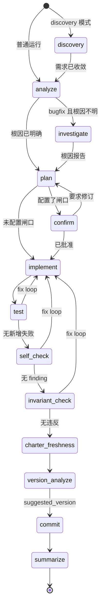

<p align="center"></p>

# tianluo（田螺）— Software Engineering 3.0 流程引擎


[English](README.md) | **中文**

> **一个项目级、跨 session 的流程框架——由程序而非人作监工来监管 AI agent。你只 prompt 一次，走开，回来时交付物已经躺在 commit 里。**

*名字来自田螺姑娘：主人下地干活，素女从螺中出来把家务悄悄做完——不打扰、不追问，回家只见做好的成果。这正是本工具的契约。写下来的地方用全名 tianluo，喊它干活时叫小名：命令是 `luo`。*

tianluo（曾以 *se3* 之名发布；方法论仍叫 **SE 3.0**）不是单次会话的 prompting 工具，不是 skill、subagent，也不是 dynamic workflow。后者是*单 session*内的增强手段，作用是放大一次"人在回路"的对话。tianluo 在它们上一层：一个 CLI 引擎 + 持久化状态机 + 一套 code-first 知识体系（code-index + charter + why-注释），监管 AI coding agent 跨多个 session、跨多台机器，直到项目级任务真正做完。

---

## 为什么选 tianluo

五条承重的押注，每条附一行让它成为既成事实、而非愿景的证据。

**1. 省下的是人的注意力，不是 token。** 一条 flow 的好坏，度量单位是"逼一个人去读、去判、去决策"的次数，而不是 LLM 调用有多便宜。
*证据：* 结构上真正需要 attention 的只有一处——开场那句 prompt；从 `plan` 到 `commit` 全程无人盯着，连 `plan` 之后的分组闸口都要你自己选择开启。

**2. 程序当监工，人 out-of-the-loop。** 决定"下一步干什么"的是一台确定性的 Python 状态机，既不是模型，也不是坐在终端前的人。
*证据：* `tianluo/state/engine.json` 持久化 step / attempt / 上下文 / fix-loop 历史，因此一条 flow 能跨终端退出、机器重启、跨机器接管而存活，并用 `luo run --resume` 从确切的中断点续跑。

**3. 代码是唯一真相源。** 知识经三件 colocated 产物暴露——code-index、charter、why-注释——全部锚定在代码本身，而非一份代码的散文镜像。
*证据：* `tianluo/specs/**` 镜像及其整套治理机械（`luo sync`、`verify_spec`、`update_spec`、`spec_gate`、per-requirement 漂移基线）已全部退役；取代它们的是一张确定性枚举出来的结构地图，加两个锚定式检查。

**4. 不假设 LLM 会自觉。** 系统所依赖的每一条性质，都由"不论模型配不配合都照跑"的代码来保证：

- **步骤路由是确定性状态机。** step 池与各 task 类型的默认序列写在 `engine/models.py`，由 `engine/state_machine.py` 遍历。LLM 从不选择下一步。
- **code-index 的完整性是枚举器的性质。** 文件树遍历 + AST 符号枚举决定*谁上地图*；LLM 只为交到它手里的符号写那一行摘要，因此它无从漏掉任何一个。
- **`invariant_check` 硬守卫 `WHY:` / `INVARIANT:` 注释。** diff 若删除或改写了一条而未恢复——也未以更新后的标记注释显式声明新理由——直接返回 `REVISION_NEEDED`。
- **check 类步骤的 finding 只有一条去向：当场进入 fix loop。** 没有丢弃通道，没有按 severity 放行，也没有"记成 issue 以后再修"（`out_of_scope` 逃生口已被移除）。
- **`test.critical_tests` 挡住"用 skip 冒充通过"。** 被配置为关键的测试若是 skip 而非真跑，test 步骤判失败，而不是报绿。
- **测试基线在 `implement` 落笔之前被确定性地捕获。** 它由引擎冻结，因此一条历史既存的红测试永远不会被改写成"本次改动引入的"，反之亦然。
- **`investigate` 的净零 diff 由引擎校验，而非由模型承诺。** 引擎在该步骤前后各拍一次工作区快照并比对，不一致即判失败。引擎自身从不 reset 或 checkout 任何东西——工作树里可能还有与本任务无关的未提交改动。
- **PLAN 的分解决策只做一次。** flow 运行在哪套分解学说与粒度之下，在 flow 创建时解析并持久化；续跑的 flow 沿用它已经进入的分组，无论此后配置如何变化，引擎也绝不中途重判。
- **`version_analyze` 缺 `suggested_version` 即报错。** 没有静默 patch bump 的兜底；流程就地停下并请人介入。

  *一句话收口：* 凡是原本只靠"LLM 应该会记得"才成立的，这里都被改写成靠代码成立。

**5. 不挑 agent。** `AgentRunner` 抽象之上已有三个既成的适配器，且"跑哪一个"是一个按步骤下发的配置决策。
*证据：* `claude-code`、`claude-interactive`、`codex` 都是已落地的 runner 类型；`agents` 注册表可在同一个池里混编厂商与价位；`llm_caller.steps.<step>` 把某条链路钉到某个步骤上，并在该链路*内部*自动轮换。

以上五条的长文版在下方：范式部分见 [设计哲学](#设计哲学)，code-first 的押注见 [知识体系](#知识体系code-index--charter--why-注释)。

---

## 设计哲学

### 1. 全新范式：程序作监工，人 out-of-the-loop

skill、subagent、dynamic workflow 让*一次 AI 对话*更聪明、或在内部更好地并行。它们是好工具，但前提是有人盯着读输出、每步介入引导。

tianluo 押的是另一边。工作的最小单位不是一次对话，而是一项**项目级任务**。在 `luo run "…"` 与最终 commit 之间，可能跨过 discovery / analyze /（investigate）/ plan / confirm / implement / test / self-check / invariant-check / charter-freshness / version-analyze / commit / summarize 等步骤上的数十次 LLM 调用、多次 agent 轮换、fix loop，甚至通过 daemon + 中心服务器在多台机器之间协作。所有这些的*监工*是 tianluo 引擎——一段跑在 Python 里的确定性状态机——而不是一个盯着终端的人。

| 工具类别 | 作用范围 | 谁作监工 | 状态在哪里 |
|---------|---------|---------|-----------|
| skill / subagent / dynamic workflow | 单 session 内一次对话（或一次对话内的 fan-out） | 人在回路、读输出 | 对话上下文 |
| **tianluo** | 一项跨多 session、多机器的项目任务 | 程序（引擎 + daemon） | 持久化文件（`tianluo/state/` / `tianluo/history/` / `tianluo/issues/`） |

### 2. 真正的痛点：attention is all you need

LLM 不是瓶颈，*人的注意力*才是。任何 agentic 系统的成本，最终都以"逼一个人去读、去判、去决策"的次数为单位。tianluo 的北极星是**节省人的 attention**。

理想的 tianluo session 长这样：

1. **Prompt** — 你打一句 `luo run "…"`（或用 `--discover` 开一次 discovery）。
2. **Discover** — 引擎用少量精准的澄清问题逼近真实需求，直到需求收敛。
3. **确认方案 — 可选，默认关闭** — 配置里没有 `confirmation.steps.plan` 时，流程直接 `plan → implement`，中间没有任何闸口。写上 `confirmation.steps.plan: {reviewer: human}` 才会得到一道人工分组 gate：你批准 plan 把工作切成的这组任务组，或把它打回去改。
4. **发射后不管** — 你走开。引擎自动 implement、test、self-check、用已记录的不变量校验 diff、标记 charter 漂移、决定版本号、commit。
5. **拿走交付物** — 回来时，分支上是干净的 commit，版本、history、code-index 已经对齐。

只有第 1–2 步、以及你主动开启后的第 3 步闸口真正需要 attention，其它都是程序应该自己干完的活。

### 3. 撑起这种范式的四件套护城河

只有在框架本身具备以下四件套时，"程序作监工"的范式才立得住——这正是 session 内工具做不到的事：

- **跨 session 状态机** — `tianluo/state/engine.json` 持久化每个 flow 的精确 step、attempt、上下文与 fix-loop 历史；`luo daemon` 提供一个常驻进程监管本机所有 `luo run` flow；`tianluo-server` 把多台 daemon 聚合成一个网页视图；`luo run --worktree` 在隔离的 git worktree 上跑**完全相同**的 flow，成功后自动合回原分支。flow 跨终端退出、机器重启、跨机器接管依然存活。*这一范式为何离不开它：* 没有持久化状态，"走开再回来"就等于丢工作。
- **code-first 知识体系（code-index + charter + why-注释）** — 事实源（source of truth）就是代码本身。一张 `tianluo/code-index.md` 结构地图（自动维护、自鲜）给 agent 一张"项目里有哪些模块/符号、各在何处"的 orientation map；一份小巧、人工维护的 `tianluo/charter.md` 只承载每个 step 都需要全量看到的高层事实（项目身份、顶层架构、项目级横切不变量）；colocated 的 why-注释承载代码表达不了的意图。*这一范式为何离不开它：* 一个长时间无人盯着的 agent 必须能在每个 step 廉价地在代码里定位自己，而不必在旁边养一份会腐烂的代码镜像。它为何胜过被它取代的 spec 镜像，见下文 [知识体系](#知识体系code-index--charter--why-注释)。
- **失败回收内建** — `luo salvage` 在 session 异常崩溃后做尽力抢救：commit 未提交改动、为遗留问题补 issue、归档 session；测试基线缓存区分"新引入的回归"与"历史既存的红测试"；issue discovery 把任何未解决的隐患落成 `tianluo/issues/` 记录。*这一范式为何离不开它：* 没人盯着的时候，框架必须自己接住自己的失败，而不是把脏状态留给下一次。
- **底座可移植性** — 引擎本身是纯 Python + 文件系统；LLM 调用层是一层薄薄的 `AgentRunner` 适配。这已不再只是"原则上"的非单一供应商押注：今天就有三个适配器随包发布，且已跨厂商跑通——
  - **`claude-code`** — 一次性的 `claude -p` 子进程（`src/tianluo/claude_runner.py`）。默认项。
  - **`claude-interactive`** — pexpect 驱动的交互式 PTY 会话（`src/tianluo/claude_interactive_runner.py`）。仅可显式选用：它需要一个真实终端，因此永不被自动选中。
  - **`codex`** — OpenAI Codex CLI（`src/tianluo/codex_runner.py`）。

  抽象层（`AgentRunner` / `RunResult` / `InfraErrorType`）保持 provider-neutral，且边界是刻意划定的：**跨命令的轮换与回退归 `LLMCaller` 所有；单个 runner 永不自行轮换。** 每个适配器只知道如何"对一条 CLI 发起一次调用"，经 `build_call_args` 做意图翻译，因此接入一个新厂商无需改动其上任何调用方。*这一范式为何离不开它：* 押在一种范式上，不应同时押在单一供应商上。

### luo vs Claude Code Dynamic Workflows（互补，而非竞争）

Dynamic Workflows 解决的是*单 session 内*的并行编排：确定性 fan-out、judge panel、pipeline，都在一次对话里完成。它把"一次对话"做得更全、更可信。

tianluo 解决的是*跨 session*的项目治理：持久化状态、code-first 知识体系、失败回收，以及一个能跨越任何单次对话的可移植底座。

两者可以叠加。未来某个 tianluo step 可以把它在 step 内部的并行工作委托给一次 Dynamic Workflow 调用，外层的状态机不变。我们故意不在 README 里钉死 DW 的具体 API 名字——DW 仍在 research preview，API 还会演进。

---

## 知识体系：code-index + charter + why-注释

早期 tianluo 维护一份平行的 `tianluo/specs/**/spec.md` 语料——一份代码的散文镜像——外加一整套治理机械来防它漂移：`luo sync` 的轮次、per-requirement 漂移基线、`verify_spec` / `update_spec` / `spec_gate` flow step，以及整套 `sync_*` analyzer/loop/state/discovery。tianluo 用三件 colocated、且事实源即代码本身的产物，取代了那份镜像。

### 三件套

- **code-index** — 项目的*结构地图*。结构来自代码本身的确定性提取（文件树遍历 + Python AST 符号枚举：目录/包 → 文件/模块 → 类 → 函数/方法）；每一级挂一句**自底向上**合成的 LLM 摘要（目录的摘要由其文件的摘要合成，文件的由其符号的合成）。它落成**单一自给自足的文件** `tianluo/code-index.md` — **权威产物，纳入版本控制**。它*就是*那张地图，是 `luo code-index` 渲染的对象，也是注入每个 flow step 的东西。因为它是 diff 里的纯文本，摘错的一条可被人在 review 中发现并纠正，且纠正 durably 落地。每个节点行还内嵌一枚内容指纹（一条简短、渲染时不可见的 HTML 注释），所以**仅凭**已提交的 md 就能判断什么变了：重建时只对指纹变更的节点重跑 LLM 摘要，未变者沿用既有摘要（从而保住人工纠正），且构建途中会周期性 flush 落盘，崩溃后能从断点续跑。**没有独立的缓存文件**——结构、摘要、指纹全都在这一个已提交、人类可 diff 的文件里。

  结构来自**代码**，而非任何缓存；显示只读 `.md`。优化目标是**结构覆盖的完整性，而非单符号摘要的深度**——地图回答*有哪些模块/符号、各在何处*，刻意**不下沉到实现细节**（那是源码本身的职责，复制进 index 只会得到一份不如代码准的镜像）。

- **charter** — `tianluo/charter.md`，旧 base spec 收缩、改名后的继任者。它在每个 step 被**全量注入**，并兼任沙箱子进程的 conventions 通道（子进程读不到 `CLAUDE.md`）。一个 *altitude gate* 只准入"**代码说不出、且全项目每个 step 都需要全量看到**"的内容：项目身份、顶层架构、项目级横切不变量。曾让 base spec 膨胀的每模块 locator 索引被甩掉了——那是 code-index 的职责。字节阈值只是监控灯、不是硬墙：因 charter 内容与项目规模解耦（只随架构复杂度增长，不随 LOC 增长），全量加载在大项目上仍然廉价；若真的大到难以全量加载，那是低层内容泄漏进来的红灯，而非给 charter 建索引的理由。

  由 `luo init` / `luo migrate` 生成的 charter 自带一条现成的编码约定：**流程生成的测试应并行安全** —— 不依赖测试之间的执行顺序、不共享可变全局状态、临时资源（文件/目录/端口/数据库名等）一律使用唯一路径。之所以一开始就写进去，是为了让项目此后可以直接打开并行测试（`test.parallel`），而不必先去拆解一个已经对顺序敏感的套件。与 why-注释纪律一样，它是 prompt 级软约定 —— 背后没有硬检查门。

- **why-注释** — colocated 注释，*只*承载代码表达不了的 why/意图，仅在 why 变化时更新。它们不作为 code-index 的来源，故无 per-change 同步税；implement step 的 prompt 只是约定：当一处改动的意图变化时，同步更新 colocated 的 why-注释。如实承认这是 prompt 级的软约定（与其它 conventions 同等强度），是把注释纪律压到最小面，而非根治。被标记为 `WHY:` / `INVARIANT:` 的那个子集是例外：它们受 `invariant_check` step 硬守卫。

### 真正变好了什么（诚实的账）

本重构**并不**提升代码描述的语义正确性：LLM 生成的摘要会以与手写 spec 一模一样的方式出错。真正的收益在别处：

- **事实源回归代码本身。** 定位与意图就活在代码旁边，而不是一份需要被持续校真的独立语料里。
- **消除 staleness。** code-index 零纪律地增量再生：确定性枚举器每次构建都重新遍历整棵树，新增的 symbol 被枚举、已删的被剪除，只有指纹变更者重跑摘要。完整性是*枚举器的性质*，而非 LLM 的自觉——LLM 只对交付给它的 symbol 生成摘要、从不决定收录谁，因此它无机会漏掉任何 symbol，而摘错的一条仍出现在地图上。
- **治理维护面骤减。** 整套 `sync_*`、`verify_spec`、`update_spec`、`spec_gate`、per-requirement 漂移基线、旧 `spec_check` 一并退役。留下的是两个廉价的锚定式检查：`invariant_check`（diff 是否违反了任一*已被记录*的 binding invariant——锚定于 {task 描述, charter, 所触代码的 why-注释}？）与 `charter_freshness`（一个仅在 diff 可能触动 charter 三类内容时才提示、否则廉价空过的 advisory）。
- **粒度与准入变为显式旋钮。** code-index 的粒度底 = 该文件类型能提供的最小*自然*语义单元（代码 → 函数/方法；结构化非代码 → 其自然单元；不透明文件 → 文件级一行），行/字节切分仅作最后降级模式、且须三条同时满足。charter 内容由一份你能读、能执行的准入标准把关。两者都是你拧的旋钮，而非你要对抗的涌现行为。
- **charter 体积与项目规模解耦。** 它随架构增长，不随代码行数增长。
- **失败态地板高于旧体系。** 即便所有软纪律都失效，那个唯一自动维护的产物——code-index——仍自鲜存活。因此系统下限严格优于旧体系"腐烂的 spec 语料 + grep"的下限。

### 一个具体的前后对照——以及 spec-index 为何永远赢不了这一局

以旧的 `spec_index.py`（约 1130 行——它本身已被本次重构退役）为例。假设你要回答一个关于它的*定位*问题：它在哪、干嘛、有哪些关键符号？

没有 code-index 时，光是回答这个，你就得把整份约 1130 行源码全量读进 context。有 code-index 后，你先看地图上关于该文件的那几行——比如，*"构建 item 级 spec 索引，增量失效 mtime + size + sha256；关键符号 `load_or_build` / `_make_summary` / `_extract_locator` / `_h4_dividers`。"* 定位类问题根本不必碰源码。而一个*精确*类问题——比如某条启发式的具体边界判断——也只需定点读那约 30 行，而非全文。

**与 spec-index 的对照是最锋利的一击。** spec / spec-index 的优势上限被一个根本事实封顶：*它与代码不在同一层*。即便假设某份 spec 绝对准确、绝对完整，它仍停在 spec 的高度、无法呈现代码层面的实际细节——所以它替你定位到文件之后，你照样得回去读代码，且为求全得通读全文。spec 大概率的不准确、不完整，只是在此之上雪上加霜；它**并非**输给 code-index 的根因。code-index 从根上不受这条封顶约束，因为它的事实源*就是*代码、且把你直接导向那约 30 行。

这正是 **coverage > depth** 这一押注的兑现：地图的职责是告诉你该翻哪约 30 行——而不是替代那约 30 行。而这种 context 节省不是一次性的：它在**每个 step、每个 flow**上复利式累积，这恰恰正是 code-index 要砍掉的成本。

> 历史决策、以及被保留下来的"已移除功能但意图保留"这类意图，都不进 charter；它们继续走 issue 通道（`luo issue`）。跨文件、无单一归属的架构决策进 charter，人工维护，接受其无法自动同步的代价。

---

## 安装

```bash
# 核心 CLI（Python 3.9+）
pip install tianluo

# 含中心服务器 / 网页控制台
pip install 'tianluo[server]'

# 含 headless-browser e2e 测试依赖（之后需 `playwright install chromium`）
pip install 'tianluo[browser]'
```

安装后注册的 console script：

| 脚本 | 用途 |
|------|------|
| `luo` | **主命令**。tianluo 的小名——文件上写全名，喊它干活叫 `luo` |
| `tianluo` | 全名入口，与 `luo` 完全等价（文档、演示、可搜索性） |
| `se3` | 改名过渡别名；调用时打一行迁移提示，13.0.0 移除 |
| `tianluo-server` | 中心网页服务器（仅在装了 `server` extra 时可用） |
| `se3-server` | `tianluo-server` 的过渡别名，13.0.0 移除 |

核心 CLI 永远不会 import web 依赖栈，所以不装 `[server]` 也能保持依赖面最小。

> 嫌 `luo` 还不够短？`alias tl=luo`。我们刻意不发 `tl`（Teal 编译器占用了它，
> 而且两个并存的短命令会分裂文档与社区语言）。

### 存量项目迁移

一共注册了两个 migrator。需要跑哪些，只取决于你的项目有多老——对号入座：

| 你的项目上一次搭建于 | 按此顺序执行 | 它做什么 |
|---|---|---|
| **11.0.0** 之前（`tianluo/specs/` spec 镜像时代） | `luo migrate run spec-to-new-system`，然后 `luo migrate run rename-to-tianluo` | 先退役 spec 镜像，再改名布局。 |
| **11.x**（已在 code-index + charter 体系上，但仍叫 `se3`） | `luo migrate run rename-to-tianluo` | `git mv se3/ → tianluo/`、配置改名、`.gitignore` 重写。 |
| **12.0.0 及以后** | 无需任何操作 | 已经在当前布局上。 |

```bash
luo migrate list          # 列出全部已注册 migrator，含 id 与说明
luo migrate run <id>      # 跑一个，落成单个可 review、可 `git revert` 的 commit
```

对最老的项目而言顺序有讲究：`spec-to-new-system` 把遗留的 `tianluo/specs/`
语料转成 code-index + charter + why-注释 体系，`rename-to-tianluo` 随后才把运行时
根目录与配置搬到新名字上。

在此期间一切照旧。整个 12.x 期间兼容层仍被尊重：`se3` / `se3-server` 命令、老的
`se3/` 运行时目录、`se3.yaml` / `se3.local.yaml` 配置全部继续可用。**所有 legacy
回落在 13.0.0 移除**——请在那之前迁移。

---

## 快速上手

```bash
# 1. 初始化项目（写 tianluo.yaml、tianluo/charter.md、.gitignore，并按需 git init）
cd your-project
luo init

# 2. 可选：先通过多轮 discovery 厘清模糊需求
luo run --discover "我想要一个能做 X 的 CLI 工具"

# 3. 端到端跑一次任务（状态机见下图）
luo run "Add JWT authentication"

# 4. 从中断的 flow 处精确续跑
luo run --resume

# 5. 用结构地图导航代码库
luo code-index                              # 自适应根地图：一棵按预算缩放的目录树
luo code-index index src/tianluo/engine     # 下钻一个字面层级（目录的直接子项）
luo code-index show src/tianluo/cli.py      # 某个文件的完整函数/方法详情
```

### 流程状态机

下图是全序列形态（`feature`、`bugfix` 与 `--discover` 运行）。图中每个节点名都是
你会在日志、`tianluo/state/engine.json` 与 `luo history show` 里看到的字面 step
标识符：



图里有三处容易被忽略：

- **`investigate` 是条件步骤，不是固定环节。** 只有当 `analyze` 把任务判为
  `bugfix` *且*报出 `root_cause_clear = false` 时，它才被插到 `plan` 之前。
  （`survey` 任务类型是另一条进入通道——它的默认序列无条件带着 `investigate`。）
  该步骤跑在一份**净零 diff** 契约之下，由引擎比对它前后各拍一次的工作区快照来校验。
- **`plan` 之后的 `confirm` 是可选的。** 只有配置里出现 `confirmation.steps.plan`
  时才会插入（写 `reviewer: human` 即人工分组 gate）；配置了之后，被驳回时流程
  回到 `plan`，而不是向前推进。
- **fix loop 是共用的。** `test`、`self_check`、`invariant_check` 的失败/finding
  一律路由回 `implement`。check 类步骤的 finding 没有别的去向——不能豁免、不能延后、
  不能降级。

### 任务类型体系

`luo run --type/-t` 只接受五个值——`feature`、`bugfix`、`small`、`review`、
`survey`。无法识别的值会被**报错拒绝**，而不是被静默兜底。不传 `--type` 时运行停在
`pending` 哨兵值上，含义是*交给 `analyze` 去判类型*。

`discovery` **不是** `--type` 的取值：它是一种运行模式，用 `luo run --discover` /
`-d` 进入，效果是在全序列前面加一个 `discovery` step。

| `--type` | 默认 step 序列 | 备注 |
|---|---|---|
| `feature` | analyze → plan → implement → test → self_check → invariant_check → charter_freshness → version_analyze → commit → summarize | 完整链路；也是持久化类型无法识别时的兜底。 |
| `bugfix` | 与 `feature` 相同，另在 `plan` 前条件插入 `investigate` | 唯一会条件性获得 `investigate` 的类型。 |
| `small` | analyze → implement → test → charter_freshness → version_analyze → commit → summarize | 无 `plan`、无 `self_check`、无 `invariant_check`。 |
| `review` | analyze → invariant_check → summarize | 只读只判：不 implement、不 test、不 commit。 |
| `survey` | analyze → investigate → summarize | 交付物是结论而非 diff——因此无 implement/test/commit，也无 `version_analyze`。 |
| *（`--discover`）* | discovery → *`feature` 链路* | 经 `--discover` 进入，而非 `--type`。 |

上表列的是 `models.py` 里字面声明的默认序列，其中并不含 `confirm` 条目。`confirm`
**只会**插在 `confirmation.steps` 列出的那些 step 之后 —— `plan` 也不例外：它和
其他步骤一样是可选的 per-step 确认，因此没有 `confirmation.steps.plan` 条目时，
带 `plan` 的类型实际跑的是 `plan → implement`，中间没有闸口。

`analyze` 仍可能调整选定的序列；上表是起点，不是冻结的契约。

#### PLAN 的分解：PLAN → IMPLEMENT 阶段如何运行

只有一条路径，不再是两条。`feature`、`bugfix` 与 discovery 流程一律运行
ANALYZE → PLAN → IMPLEMENT，没有任何配置能把 PLAN 从序列里裁掉。变化的只是
PLAN 产出什么，而在粒度把组数留给 PLAN 决定时，**执行形态由组数读出**：

- **单组** —— IMPLEMENT 把整个任务作为一次自治 implement 调用执行；
- **两组及以上** —— 沿用依赖 DAG：互相独立的组在隔离 worktree 中并行执行并
  合并回来，声明了依赖的组顺序执行。

`plan_granularity: single` 是唯一的例外钉点：它是配置保证而非对 PLAN 的提示——
无论 PLAN 产出几个组，整个任务都由一次自治调用交付。

`workflow.plan_decomposition` 选择 PLAN 遵循哪套学说：

- **`capability`**（默认）—— 粗粒度的组，切分的唯一依据是*一次自治 implement
  调用能否安全承载*。一个功能一次调用能完成 → 一个组；扛不下 → 拆成两个或多个；
  天然两个功能但一次调用合起来也能完成 → 仍是一个组；处于边缘 → 一个功能一组
  （组内聚合得越多，触发切分的阈值越低）。禁止按制品类型或代码分层切分：不得有
  独立的 test 组、docs 组、config 组——测试是每个组自身交付的组成部分。该模式下
  PLAN 不输出逐条 task 列表，组只携带 `group_id` / `name` / `description` /
  `group_order` / `depends_on`，组内细化分解交给 implement runner 已有的
  planning / sub-agent 体系在执行时对着真实代码去做。
- **`granular`** —— 保留下来的 legacy 学说：细粒度逐条 task 列表、LOC 驱动的
  合并与 DAG 阈值、关口上的 requirement→task 覆盖审查。

`workflow.plan_granularity` 仅在 `capability` 下生效：`auto`（默认）由 PLAN 自行
估算组数，`single` 无论任务多大都只出一个组，`conservative` 降低切分阈值、更倾向
拆分。

优先级：显式 CLI（`--plan-decomposition` / `--plan-granularity`）或 Web 请求 →
项目配置 → `capability` + `auto`。决策在 flow 创建时只做一次并连同理由持久化 ——
续跑的 flow 沿用它已经进入的学说，其分组也绝不中途重判。

整体单次调用的形态适用于所有可写 agent runner；不使用任何 runner 原生的 goal
循环 —— 每个 runner 都经其普通自主接口执行调用，完成度压力始终由 flow 自身的
质量门（TEST / review / fix-iteration）承担，绝非 runner 侧状态。partial 结果
或非空 `incomplete_tasks` 绝不会前进到
TEST —— flow 经正常 retry/resume 机制重入 IMPLEMENT，后继 caller 在现有工作区
继续。

想为分组加一道闸口，就在 `confirmation.steps` 里声明 `plan`（`reviewer: human`
即人工分组 gate）。`capability` 下这道 review 审的是：组数是否与任务体量匹配、
有没有哪个组是按被禁止的制品类型切出来的、`depends_on` 是否成立。

SELF_CHECK 以**有效任务描述**为验收权威（原始任务或 discovery 精化、用户
interjection、裁决后的描述），外加 charter 与 `WHY:`/`INVARIANT:` 约束 —— PLAN、
task groups 与 implementation summary 只是调度线索。审查按可恢复基线界定的
scoped round 运行：首轮 `full` 覆盖本 flow 改动的全部内容，修复后的轮次为
`incremental`（聚焦该次 fix 的精确 diff），incremental 干净之后总是跟随一个
`full` closure round 才能继续前进；有效需求一旦改变即强制回到 `full`。TEST 始终
执行项目配置的完整测试 —— 审查范围绝不缩小它 —— 每个通过验证的 finding 也一律
进入 fix loop。

### 三种运行形态

- **`luo run --worktree`** — 在自己的 git worktree 里跑**完全相同**的 flow：相同
  步骤、相同状态持久化、相同 `--resume`、相同 `--type`。成功后由重量级的
  `luo merge` 编排器自动把分支合回发起分支。多个 `--worktree` 运行可以并发执行
  ——flow 主体不持锁——它们只在各自最终的 merge 处竞争，由主 worktree 互斥锁
  （`tianluo/state/merge.lock`，阻塞式 queue-and-wait）把它们彼此、以及与任何同步
  运行相互串行化。终止运行泄漏下来的 worktree 由 `luo worktree gc` 回收。
- **`luo daemon start`** — 启动常驻后台进程，监管本机所有 `luo run`，聚合
  `tianluo/state|logs|calls|issues` 状态，并可选地经单条出站连接拨入中心服务器。
  让你从任何地方查看 flow 进度。
- **`tianluo-server`** — FastAPI + WebSocket 中心服务器（自带静态网页控制台挂在
  `/`），把多台 daemon 汇聚到同一张多机视图上。适合 fleet、远程发布任务、用浏览器
  盯长跑 flow。默认监听 `127.0.0.1:8080`。

### 网页控制台


控制台不是"给 CLI 挂上去的日志查看器"——它是第二个完整的控制面，而且对
out-of-the-loop 的工作方式来说，它通常才是你真正待着的地方。它给你什么：

- **跨机器的 fleet 总览。** 每台绑到你账号下的 daemon 都出现在同一份列表里，连同
  它的项目与正在跑的 flow。一个浏览器标签页同时覆盖笔记本、工作站和构建机。
- **在网页里新建任务。** *+ New Task* 选择目标机器、一个已注册的项目根目录（或手工
  输入绝对路径——若该目录还不是 tianluo 项目，daemon 会先在那里跑 `luo init`）、
  任务类型（或 `auto`）以及任务正文。你不需要在目标机器上有一个 shell。
- **在网页里应答 discovery。** `--discover` 运行的多轮需求澄清完全可以在浏览器里
  作答；*"Start from discovery step"* 复选框在新建任务表单与从 issue 发起 flow 时
  都可用。
- **人工介入闸口。** 需要你处理的 flow 会显示为 **PAUSED** / **needs response**；
  你可以就地回复、批准或驳回一次 plan 确认（`approve` / `reject`，或任何其它文本
  作为修订要求）、向仍在跑的 flow 插一条指令，然后 **Resume**——或者 **End** 这个
  session 并归档它。
- **历史记录。** 已完成的 session 可逐 step 浏览，附每步记录以及该 session 消耗的
  总 token 与费用。
- **Issues 面板。** 跨机器、跨项目浏览 open 与 closed issue，按来源 / 项目 / 类型
  过滤，创建 issue，带原因关闭 issue，并直接从一条 issue 发起 flow。
- **文件上传，内联进 prompt。** 拖拽、粘贴或选取文件；它们被转交给所属 daemon 并
  存放在项目的 `tianluo/uploads/` 下，命名为 `<content-hash>_<filename>`（单文件
  20 MB 上限）。路径会被内联进 agent 收到的 prompt 正文，图片附件另外在消息下方
  渲染成内联缩略图——缩略图是对 prompt 正文的*追加*、绝不是对它的替换，点击一下
  即可打开原图。
- **移动端布局。** 控制台一路响应式到手机宽度，所以那道 approve/reject 闸口在你
  人在哪儿都能应答。


*fleet 总览：多台机器、它们的项目，以及所有在跑的 flow，尽在一屏。此截图摄于更名前的早期版本，界面上仍是 SE3 的 branding。*


*在手机上应答一次确认闸口。此截图摄于更名前的早期版本，界面上仍是 SE3 的 branding。*

#### 网页控制台鉴权

中心服务器是一个多租户控制面——网页控制台与 REST API 都需要登录，每台机器 / 每个
flow 都按其所属 owner 隔离。首次启用的动线是：

1. **铸发 break-glass admin token** — 跑一次 `tianluo-server bootstrap-token`，它会把
   一次性 admin token 打印到控制台。
2. **登录** — 打开网页控制台，用该 token 换取 break-glass admin 会话
   （`POST /api/auth/breakglass`）。
3. **建本地用户** — 以 admin 身份邀请 / 创建账号（`POST /api/users`）。v1 不开放
   公开自助注册。
4. **签发 daemon key** — 每个 owner 在 UI 中自助铸发一把 daemon key
   （`POST /api/daemon-keys`），再用 `luo daemon start --daemon-key <key>` 把工作机
   绑到自己名下。owner 只能看到自己名下的机器与 flow。

完整的端到端鉴权操作指引与配置键见
[docs/daemon-and-server.zh.md](docs/daemon-and-server.zh.md#鉴权与多租户访问)。

---

## 命令清单

下表中的每条命令都注册在 `src/tianluo/cli.py` 或其某个 sub-typer 中。

### 顶层命令

| 命令 | 用途 |
|------|------|
| `luo run [TASK]` | 统一入口。驱动 flow engine 状态机（见[上文的状态机图](#流程状态机)）。参数：`--resume` / `-r`、`--type` / `-t`、`--change` / `-c`、`--flow-id`、`--discover` / `-d`、`--from-issue`、`--output-format`、`--preset`、`--worktree`。 |
| `luo init` | 初始化新项目：写 `tianluo.yaml`、`tianluo/charter.md`、`.gitignore`，按需 `git init`。参数：`--project-root` / `-p`、`--name` / `-n`、`--force` / `-f`。 |
| `luo guardrails <spec-file>` | 对文件跑 tianluo guardrails（检测被删除的行 / 被弱化的语言）；`--sizes` 跑项目级的尺寸检查。供 `luo merge` 共用。参数：`--original` / `-o <baseline-file>`。 |
| `luo merge <branch> [<branch> ...]` | 按序把多个分支合并到当前 HEAD，冲突由 LLM 驱动解决，随后从合入的 intent 中调和出最终版本号。参数：`--strategy` / `-s` `fast\|safe\|strict`、`--delete-merged` / `-d`、`--no-delete-merged`。`tianluo/` 下的运行时数据按分层策略同步。 |
| `luo merge-respond <call-file>` | 处理 `luo merge` 在冲突或 guardrail 违规升级为人工 call 时写出的人工决策文件。 |
| `luo merge-unlock` | 查看并释放项目的 merge 锁（`tianluo/state/merge.lock`）。总是报告持有者 PID、其存活状态与锁路径。陈旧锁自动清理；被**本机**存活进程持有的锁除非加 `--force` / `-f` 否则拒绝释放。归**另一台机器**所有的锁永不自动打破——释放它永远是一次显式的运维决策。 |
| `luo salvage` | 对异常终止的 session 做尽力抢救：宽容地加载 state、commit 残留 diff、为未完成工作补 issue、归档 session。参数：`--project-root` / `-p <path>`。 |
| `luo end-session [FLOW_ID]` | 结束并归档一个 session：终止存活的 `luo run` 进程（并清掉其 pid 文件）、归档 state。`--worktree` session 会像完成的运行那样被归档——worktree 归档、终态提升、history 同步、隔离分支与 worktree 移除——但其未完成的工作**不会**被合并。参数：`--project-root` / `-p`、`--pid`、`--no-archive-worktree`。 |

#### `luo run` 中值得一提的参数

- **`--preset <name>`** — 从 **preset prompt 库**发起任务，而不必手打 prompt。preset
  来自合并成同一份注册表的两层：随包发布的内置层，以及项目层——`tianluo/prompts/`
  下随项目入库的 markdown 文件，其元数据（`type` 与 `prompt_file`）声明在
  `tianluo.yaml` 的 `presets:` 段。**同名冲突时项目层覆盖内置层。**
  `luo run --preset list` 会打印全部可用 preset 及其类型与所属层。一个 preset 自带
  任务类型，因此它与显式 `--type` 互斥。
- **`--from-issue <id>`** — 以 `tianluo/issues/` 中一条既有 issue 作为输入发起 flow，
  并在 flow 结束时把结果写回该 issue（成功完成的 flow 会解决它）。这正是
  `luo salvage` 为未完成工作补完 issue 之后的预期跟进路径。
- **`--plan-decomposition capability|granular`** — 新 flow 的显式分解学说请求
  （见上文 PLAN 的分解一节）。省略时读项目配置、再回落 `capability`。
- **`--plan-granularity auto|single|conservative`** — 新 flow 的显式组数粒度
  请求，仅在 `capability` 下生效。省略时读项目配置、再回落 `auto`。
  两个参数在 resume 时都会被忽略：flow 沿用它创建时的那套学说。
- **`--implementation-strategy auto|direct|planned`** — **已退役，将在下一个主
  版本移除。**保留一个版本，按兼容映射翻译为上面两个选项（`direct` →
  `--plan-granularity single`，`planned` → `--plan-decomposition granular`，
  `auto` → 新的默认值），并打印弃用提示。显式写下的新选项胜过该映射。

### `luo code-index` — 结构地图

| 子命令 | 用途 |
|--------|------|
| `luo code-index` | 从 `tianluo/code-index.md` 渲染**自适应根地图**：一棵按字节预算缩放的目录树（顶层始终显示；代码目录在预算内展开几层）。这正是注入每个 flow step 的那张地图。读取已提交的地图（未构建时提示先 `rebuild`）；flow step 会按需懒增量保持其新鲜。 |
| `luo code-index index [PATH]` | 渲染 `PATH` 处**恰好一个字面层级**：目录的直接子项（子目录 + 文件），或文件的函数/方法。无参 → 字面根层级。与裸命令不同，它从不自动展开。 |
| `luo code-index show <path>` | 从结构地图打印某个文件的完整函数/方法详情（及任何降级 chunk）。 |
| `luo code-index search <pattern>` | grep 地图的 item 行——`grep tianluo/code-index.md` 的直接替代品，区别是命中的**符号**行自带其所属文件的完整路径（`relpath::local_id`），且不会有指纹注释泄漏到输出里。语法与 grep 对齐：默认正则，`-i` / `--ignore-case`、`-F` / `--fixed-strings`、`-m N` / `--max-count`、`-n` / `--line-number`。退出码遵循 grep（0 = 有命中，1 = 无，2 = 正则非法）。 |
| `luo code-index rebuild [--force]` | 重建 code-index，构建途中周期性 flush md 作为 checkpoint。默认增量（只对指纹变更的节点重跑摘要）；`--force` 全量重跑。 |
| `luo code-index inspect` | 从磁盘上的地图展示 code-index 统计（文件 / 符号 / 降级 chunk 计数）。 |

### `luo history` — flow 历史

| 子命令 | 用途 |
|--------|------|
| `luo history` / `luo history list` | 列出活跃 / 归档 / history-only 三处的 flow。参数：`--active-only` / `--archived-only` / `--json`。 |
| `luo history show <flow_id>` | 展示某个 flow 的逐 step 结构化详情。参数：`--detailed`（LLM 调用细节）/ `--verbose`（完整 tool-call 流）/ `--json`。 |
| `luo history restore <flow_id>` | 按 ID 续跑某个 flow（委托给 `luo run --resume --flow-id`）。`--dry-run` 仅打印命令不执行。 |
| `luo history archived` | 仅列出归档 flow。`--json` 输出机读 JSON。 |

`luo history show <flow_id>` 还会打印一块独立的**用量 / 成本**区域 —— 逐 LLM
call/attempt、逐 step 与 flow 合计（输入 / 输出 / 缓存 tokens、供应商 actual
cost、估算成本、unknown 计数与完整性），外加该 flow 的 plan mode（分解学说、
粒度、组数）与 self-check scope audit。供应商 actual cost 保持权威并与估算分列；用量、模型或价格缺失时
显示 `unknown`/partial，绝不显示误导性的 `$0`。`--json` 输出同一份结构化汇总。
网页控制台的 history 视图与 live-flow 侧栏展示同一后端数字。


### `luo issue` — 项目 issue

| 子命令 | 用途 |
|--------|------|
| `luo issue` / `luo issue list` | 默认列出 open issue。`--all` 含已关闭；`--type <t>` 按类型过滤。 |
| `luo issue show <id>` | 展示某条 issue 的全部细节。 |
| `luo issue create` | 交互式创建新 issue（title / description / type / priority / tags）。 |
| `luo issue edit <id>` | 用 `$EDITOR`（缺省回落 `vi`）打开该 issue，并把编辑后的 YAML 写回。 |
| `luo issue close <id>` | 关闭一条 issue。`--reason <text>` 记录原因。 |
| `luo issue reset <id>` | 把 in-progress 的 issue 重置回 `open`。 |

### `luo migrate` — 布局 / 格式迁移

| 子命令 | 用途 |
|--------|------|
| `luo migrate list` | 列出已注册的 migrator——当前为 `spec-to-new-system` 与 `rename-to-tianluo`。 |
| `luo migrate run <id>` | 把一个 migrator 作为单个可 review、可 `git revert` 的变更执行。该跑哪个见[存量项目迁移](#存量项目迁移)。 |

### `luo worktree` — 隔离 worktree

| 子命令 | 用途 |
|--------|------|
| `luo worktree gc` | 回收泄漏的 `luo run --worktree` 运行：枚举 `tianluo/worktrees/` 下引擎状态已终态（COMPLETED / FAILED）且闲置至少 `--max-age-hours`（默认 24）小时的 worktree 运行，逐个归档它、把其终态提升进主归档、并移除该 worktree。分支**仅在可证明已合并时**才删除；未合并分支的 ref 一律保留并以醒目警告报出。参数：`--max-age-hours`、`--dry-run`、`--project-root` / `-p`。有任何一个运行出错则以非零码退出。 |

### `luo daemon` — 常驻控制面

| 子命令 | 用途 |
|--------|------|
| `luo daemon start` | 启动 daemon。`--foreground` 不脱离终端；`--server-url <ws://…>` 向中心服务器注册；`--daemon-key <key>` 在多租户服务器上把本机绑定到某个 owner。 |
| `luo daemon stop` | 停止运行中的 daemon。 |
| `luo daemon status` | 报告运行状态、machine id、server URL、真实连接状态与已跟踪 flow。`--json` 输出机读 JSON。 |

---

## 目录布局

`tianluo/` 下所有内容默认 gitignored，*除了*下表中显式 whitelist 的子路径（code-index
地图、charter、issues、scripts、prompts、version-intents 与 `version-rules.md` 入库；
运行时 state 与 log 不入库）。

```
your-project/
├── tianluo.yaml                   # 项目配置（入库）
├── tianluo.local.yaml             # 本地覆盖 —— 整文件择一，不是按 key 合并（gitignored）
├── pyproject.toml                 # 项目版本号的单一事实源
├── VERSIONS.md                    # 更新日志（由 documentation-updater 维护）
├── scripts/                       # 辅助脚本
├── .gitignore                     # 由 `luo init` 创建 / 追加
└── tianluo/                       # tianluo 运行时根目录
    ├── code-index.md             # ✅ 入库 — 权威结构地图（注入 LLM，可供人 review）
    ├── charter.md                # ✅ 入库 — 项目身份 / 架构 / 不变量，每个 step 全量注入
    ├── issues/                   # ✅ 入库 — open/ 与 closed/ YAML 记录
    ├── scripts/                  # ✅ 入库 — 可选的项目版本脚本（version.py / version.sh）
    ├── prompts/                  # ✅ 入库 — 项目级 preset prompt 正文（luo run --preset）
    ├── version-intents/          # ✅ 入库 — per-flow 版本意图，merge 时消费
    ├── version-rules.md          # ✅ 入库 — 可选，默认不存在
    ├── state/                    # ❌ runtime — engine.json、merge.lock、run.pid …
    │   └── archive/              #   归档的 engine 快照
    ├── history/                  # ❌ runtime — per-flow per-step 的 jsonl 对话
    ├── logs/                     # ❌ runtime — 执行日志（含 logs/llm/ 调用 trace）
    ├── calls/                    # ❌ runtime — 待处理的人工 call 文件
    ├── collab/                   # ❌ runtime — 协作产物
    ├── uploads/                  # ❌ runtime — 网页控制台附件，`<content-hash>_<filename>`
    ├── cache/                    # ❌ runtime — 衍生缓存（构建锁等）
    ├── tmp/                      # ❌ runtime — 临时 prompt / response 快照
    └── worktrees/                # ❌ runtime — `--worktree` 隔离 worktree（含 .archive/）
```

---

## 在代码库里导航

code-index *就是*进入这个代码库的索引。从根视图开始往下钻——先读地图上那几行，
只有在需要某个符号背后的实现细节时才打开源码文件：

```bash
luo code-index                                         # 自适应根地图（按预算缩放的目录树）
luo code-index index src/tianluo/engine                # 一个层级：engine 包的直接子项
luo code-index show src/tianluo/engine/code_index.py   # 该文件的完整符号树
luo code-index search 'merge.*lock'                    # 按关键词或正则查找 item
```

同一张根视图地图会自动注入每个 flow step，所以 agent 永远带着一张项目级的
orientation map；更深的函数级细节按需拉取。charter（`tianluo/charter.md`）与它一起
全量注入，承载每个 step 都需要全量看到的高层事实——项目身份、顶层架构、项目级
不变量。

---

## 延伸文档

| 文档 | 内容 |
|---|---|
| [docs/configuration.zh.md](docs/configuration.zh.md)（[English](docs/configuration.md)） | 权威配置参考：配置文件如何被解析，以及每个配置块、每个 key 的类型、默认值、语义与坑。往 `tianluo.yaml` 里写任何东西之前先读它。 |
| [docs/daemon-and-server.zh.md](docs/daemon-and-server.zh.md)（[English](docs/daemon-and-server.md)） | 可选的常驻控制面：`luo daemon` 与 `tianluo-server` 的安装运行、连接模型、多租户鉴权、TLS 反代部署，以及自带的网页控制台。 |

仓库根目录的 `tianluo.example.yaml` 刻意保持为一份精简的起步配置；它是起点，不是参考手册。

---

## 版本与许可证

- 版本号只活在 `pyproject.toml` 里，别无他处。它由引擎的 `version_analyze` step 决定、由 `commit` step 写入——请勿手工编辑，也不要把它抄进其它文件（本 README 顶部的徽章正是为此而从 `pyproject.toml` 实时读取）。
- License：Apache-2.0。
- 完整更新日志见 [VERSIONS.md](VERSIONS.md)。
